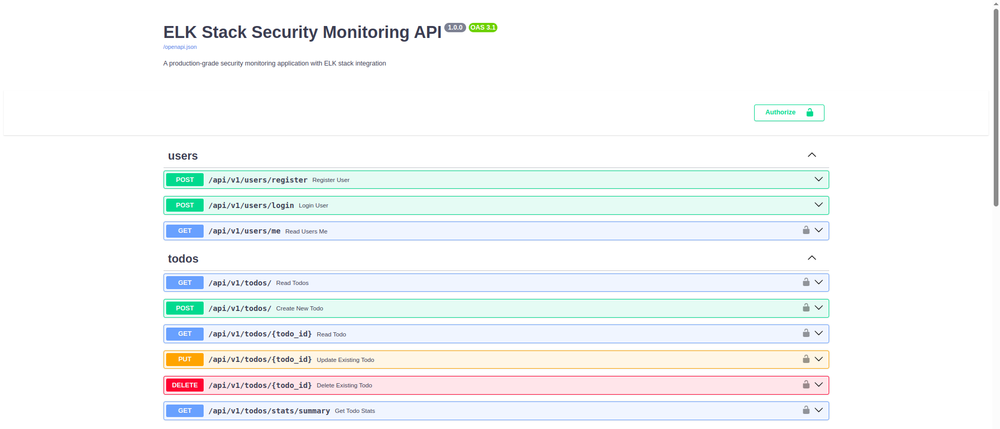

# Contributing to Advanced Threat Detection System

Thank you for your interest in contributing to the Advanced Threat Detection System! This document provides comprehensive technical information for developers, security researchers, and system administrators.

## Table of Contents

- [Development Setup](#development-setup)
- [API Endpoints](#api-endpoints)
- [Usage Examples](#usage-examples)
- [Environment Configuration](#environment-configuration)
- [Database Schema](#database-schema)
- [Testing](#testing)
- [Code Quality](#code-quality)
- [Monitoring & Metrics](#monitoring--metrics)
- [Security Configuration](#security-configuration)
- [ELK Stack Technical Details](#elk-stack-technical-details)
- [Production Deployment](#production-deployment)
- [Troubleshooting](#troubleshooting)

## Development Setup

### Manual Setup

1. Create and activate virtual environment:
```bash
python3 -m venv venv
source venv/bin/activate  # On Windows: venv\Scripts\activate
```

2. Install dependencies:
```bash
pip install -r requirements.txt
```

3. Set up environment variables:
```bash
cp .env.example .env
# Edit .env with your configuration
```

4. Start PostgreSQL and Redis services

5. Run database migrations:
```bash
alembic upgrade head
```

6. Start the application:
```bash
uvicorn app.main:app --reload --host 0.0.0.0 --port 8000
```

### Database Migrations

Create a new migration:
```bash
alembic revision --autogenerate -m "Description of changes"
```

Apply migrations:
```bash
alembic upgrade head
```

## API Endpoints
<p align="center">
  <a href="./assets/images/backend_example.png" target="_blank" rel="noopener">
    
  </a>
</p>

### Authentication

- `POST /api/v1/users/register` - Register a new user
- `POST /api/v1/users/login` - Login user
- `GET /api/v1/users/me` - Get current user info

### Todos

- `GET /api/v1/todos/` - List todos with optional filters
- `POST /api/v1/todos/` - Create a new todo
- `GET /api/v1/todos/{id}` - Get a specific todo
- `PUT /api/v1/todos/{id}` - Update a todo
- `DELETE /api/v1/todos/{id}` - Delete a todo
- `GET /api/v1/todos/stats/summary` - Get todo statistics

### Security & Monitoring

- `GET /api/v1/security/threats/brute-force` - Detect brute force attacks
- `GET /api/v1/security/threats/data-exfiltration` - Detect data exfiltration attempts
- `GET /api/v1/security/threats/powershell` - Detect suspicious PowerShell activity
- `GET /api/v1/security/threats/apt-correlation` - APT kill-chain correlation analysis
- `GET /api/v1/security/threats/scan` - Comprehensive threat scan
- `GET /api/v1/security/hunt/comprehensive` - Run comprehensive threat hunting
- `GET /api/v1/security/hunt/apt-kill-chain` - APT kill-chain hunting
- `GET /api/v1/security/hunt/lateral-movement` - Lateral movement detection
- `GET /api/v1/security/hunt/powershell-external` - External PowerShell activity detection
- `GET /api/v1/security/hunt/privilege-escalation` - Privilege escalation detection

### System

- `GET /health` - Health check endpoint
- `GET /metrics` - Prometheus metrics
- `GET /docs` - Interactive API documentation (development only)

## Usage Examples

### Register a new user
```bash
curl -X POST "http://localhost:8000/api/v1/users/register" \
  -H "Content-Type: application/json" \
  -d '{
    "email": "user@example.com",
    "username": "testuser",
    "password": "securepassword123"
  }'
```

### Login
```bash
curl -X POST "http://localhost:8000/api/v1/users/login" \
  -H "Content-Type: application/x-www-form-urlencoded" \
  -d "username=user@example.com&password=securepassword123"
```

### Create a todo
```bash
curl -X POST "http://localhost:8000/api/v1/todos/" \
  -H "Authorization: Bearer YOUR_TOKEN" \
  -H "Content-Type: application/json" \
  -d '{
    "title": "Security Assessment",
    "description": "Conduct quarterly security review",
    "priority": "high",
    "due_date": "2024-12-31T10:00:00Z"
  }'
```

### Get todos with filters
```bash
curl "http://localhost:8000/api/v1/todos/?completed=false&priority=high&search=security" \
  -H "Authorization: Bearer YOUR_TOKEN"
```

### Test Security Monitoring
```bash
# Test threat detection capabilities
curl "http://localhost:8000/api/v1/security/threats/brute-force"
curl "http://localhost:8000/api/v1/security/threats/data-exfiltration"
curl "http://localhost:8000/api/v1/security/threats/powershell"
curl "http://localhost:8000/api/v1/security/threats/apt-correlation"

# Run comprehensive threat hunting
curl "http://localhost:8000/api/v1/security/hunt/comprehensive"
```

## Environment Configuration

### Core Application Variables

| Variable | Description | Default |
|----------|-------------|---------|
| `DATABASE_URL` | PostgreSQL connection string | Required |
| `REDIS_URL` | Redis connection string | Required |
| `SECRET_KEY` | JWT secret key | Required |
| `ALGORITHM` | JWT algorithm | HS256 |
| `ACCESS_TOKEN_EXPIRE_MINUTES` | Token expiration time | 30 |
| `ENVIRONMENT` | Environment (development/production) | development |
| `LOG_LEVEL` | Logging level | INFO |

### ELK Stack Configuration

```bash
# ELK Stack Configuration
ELASTICSEARCH_URL=http://elasticsearch:9200
ELASTICSEARCH_HOST=elasticsearch
ELASTICSEARCH_PORT=9200
KIBANA_HOST=kibana
KIBANA_PORT=5601
LOGSTASH_HOST=logstash
LOGSTASH_PORT=5044
LOGSTASH_TCP_PORT=5000

# Elasticsearch Settings
ES_JAVA_OPTS=-Xms512m -Xmx512m
ELASTIC_PASSWORD=changeme
KIBANA_PASSWORD=changeme
```

## Database Schema

### Users Table
- `id` (Primary Key)
- `email` (Unique)
- `username` (Unique)
- `hashed_password`
- `is_active`
- `created_at`
- `updated_at`

### Todos Table
- `id` (Primary Key)
- `title`
- `description`
- `completed`
- `priority` (low, medium, high)
- `due_date`
- `created_at`
- `updated_at`
- `owner_id` (Foreign Key to Users)

## Testing

### Running Tests

Run the test suite:
```bash
pytest
```

Run tests with coverage:
```bash
pytest --cov=app --cov-report=html
```

Run specific test categories:
```bash
# Test authentication
pytest tests/test_auth.py

# Test security features
pytest tests/test_security.py

# Test API endpoints
pytest tests/test_todos.py
```

### Integration Testing

Test ELK stack integration:
```bash
# Test Elasticsearch connectivity
curl http://localhost:9200/_cluster/health

# Test Logstash pipeline
curl http://localhost:9600/_node/stats

# Test Kibana API
curl http://localhost:5601/api/status
```

## Code Quality

### Code Formatting

Format code with Black:
```bash
black app/ tests/
```

### Linting

Lint code with flake8:
```bash
flake8 app/ tests/
```

### Type Checking

Run type checking with mypy:
```bash
mypy app/
```

### Pre-commit Hooks

Set up pre-commit hooks:
```bash
pre-commit install
pre-commit run --all-files
```

## Monitoring & Metrics

### Prometheus Metrics

The application exposes metrics at `/metrics` including:

#### Request Metrics
- `requests_total{method, endpoint, status}` - Total request count
- `request_duration_seconds` - Request duration histogram

#### Application Metrics
- `active_users_total` - Current active users
- `todos_total{status}` - Total todos by status
- `security_events_total{type}` - Security events by type

#### System Metrics
- `python_gc_objects_collected_total` - Garbage collection stats
- `process_resident_memory_bytes` - Memory usage
- `process_cpu_seconds_total` - CPU usage

### Structured Logging

Log format includes:
```json
{
  "timestamp": "2024-01-01T00:00:00Z",
  "level": "INFO",
  "logger_name": "app.main",
  "message": "User logged in successfully",
  "request_id": "req-123",
  "user_id": "user-456",
  "ip_address": "192.168.1.100",
  "user_agent": "Mozilla/5.0...",
  "security_event": "authentication_success"
}
```

### Health Check Response

The `/health` endpoint returns:
```json
{
  "status": "healthy",
  "database": "ok",
  "redis": "ok",
  "elasticsearch": "ok"
}
```

## Security Configuration

### Development Environment
- Basic authentication enabled
- CORS configured for localhost
- Debug logging enabled
- HTTP connections allowed

### Production Hardening Checklist

#### Application Security
- [ ] Set strong `SECRET_KEY` (64+ characters)
- [ ] Enable HTTPS/TLS encryption
- [ ] Configure proper CORS policies
- [ ] Set secure session cookies
- [ ] Enable rate limiting
- [ ] Implement request size limits

#### Database Security
- [ ] Use strong database passwords
- [ ] Enable SSL connections
- [ ] Configure connection pooling
- [ ] Set up read replicas for scaling
- [ ] Implement backup encryption

#### ELK Stack Security
- [ ] Enable Elasticsearch security
- [ ] Configure SSL/TLS for all communications
- [ ] Set up role-based access control (RBAC)
- [ ] Enable audit logging
- [ ] Configure network segmentation
- [ ] Use encryption at rest

## ELK Stack Technical Details

### Elasticsearch Configuration
- **Port**: 9200
- **Memory**: 512MB (configurable via ES_JAVA_OPTS)
- **Indices**:
  - `security-auth-logs-*` - Authentication events
  - `security-network-logs-*` - Network security events
  - `security-audit-logs-*` - File access events
  - `security-alerts-*` - Security alerts
  - `windows-security-logs-*` - Windows events

### Logstash Pipeline Configuration
- **Input Ports**:
  - 5044 (Beats input)
  - 5000 (TCP input)
  - 9600 (API/Monitoring)
  - 514 (Syslog)
  - 12201 (GELF)
- **Processing**: GeoIP enrichment, threat scoring, field parsing
- **Output**: Elasticsearch with index routing

### Kibana Dashboards
- **Security Overview**: Real-time threat dashboard
- **Geographic Map**: Attack source visualization
- **Authentication Monitoring**: Login analysis
- **Investigation Tools**: Detailed threat analysis

### Beats Configuration

#### Filebeat
```yaml
filebeat.inputs:
- type: log
  paths:
    - /var/log/auth.log
    - /var/log/syslog
  fields:
    service: security
    environment: production
```

#### Metricbeat
```yaml
metricbeat.modules:
- module: system
  metricsets: ["cpu", "memory", "network", "filesystem"]
  period: 10s
```

## Production Deployment

### Infrastructure Requirements

#### Minimum Setup
- **CPU**: 4 cores
- **RAM**: 8GB
- **Storage**: 50GB SSD
- **Network**: 1Gbps

#### Recommended Setup
- **CPU**: 8 cores
- **RAM**: 16GB
- **Storage**: 200GB SSD
- **Network**: 1Gbps
- **Redundancy**: Multi-AZ deployment

#### Enterprise Setup
- **CPU**: 16+ cores
- **RAM**: 32GB+
- **Storage**: 1TB+ SSD with RAID
- **Network**: 10Gbps
- **Redundancy**: Active-active clustering

### Docker Production Configuration

```yaml
# docker-compose.prod.yml
version: '3.8'
services:
  app:
    build: .
    environment:
      - ENVIRONMENT=production
      - LOG_LEVEL=WARNING
    deploy:
      replicas: 3
      resources:
        limits:
          cpus: '1.0'
          memory: 1G
```

### Scaling Strategies

#### Application Scaling
- Use load balancer (nginx, HAProxy)
- Deploy multiple app instances
- Implement connection pooling
- Use Redis clustering for cache

#### ELK Stack Scaling
- **Elasticsearch**: Multi-node cluster with proper sharding
- **Logstash**: Multiple pipeline workers
- **Kibana**: Load balance multiple instances
- **Storage**: Implement index lifecycle management

### Security Best Practices

#### Network Security
- Use private VPC/networks
- Implement security groups/firewall rules
- Enable VPN for administrative access
- Use jumpbox for SSH access

#### Data Protection
- Encrypt data at rest and in transit
- Implement proper key management
- Regular security audits
- Log retention policies

#### Access Control
- Multi-factor authentication
- Role-based access control
- Regular access reviews
- Audit trails for all actions

## Troubleshooting

### Common Issues

#### Services Not Starting
```bash
# Check service status
docker-compose ps

# View service logs
docker-compose logs -f elasticsearch
docker-compose logs -f logstash
docker-compose logs -f kibana

# Check resource usage
docker stats
```

#### Memory Issues
```bash
# Reduce Elasticsearch memory
export ES_JAVA_OPTS="-Xms256m -Xmx256m"

# Check system memory
free -h
top
```

#### Connection Issues
```bash
# Test connectivity
curl http://localhost:9200/_cluster/health
curl http://localhost:5601/api/status
curl http://localhost:8000/health

# Check network ports
netstat -tulpn | grep -E '(8000|9200|5601|5044)'
```

### Performance Tuning

#### Elasticsearch Optimization
```bash
# Check index health
curl "localhost:9200/_cat/indices?v"

# Optimize indices
curl -X POST "localhost:9200/_optimize"

# Adjust refresh interval
curl -X PUT "localhost:9200/security-*/_settings" \
  -H "Content-Type: application/json" \
  -d '{"index": {"refresh_interval": "30s"}}'
```

#### Database Optimization
```sql
-- Check slow queries
SELECT query, mean_time, calls
FROM pg_stat_statements
ORDER BY mean_time DESC LIMIT 10;

-- Add indexes for performance
CREATE INDEX CONCURRENTLY idx_todos_owner_priority
ON todos(owner_id, priority);
```

### Debugging

#### Application Debugging
```bash
# Enable debug logging
export LOG_LEVEL=DEBUG

# Run with debugger
python -m debugpy --listen 5678 --wait-for-client -m uvicorn app.main:app

# Check application logs
tail -f logs/app.log
```

#### ELK Stack Debugging
```bash
# Check Elasticsearch logs
docker-compose logs elasticsearch | tail -100

# Test Logstash parsing
echo '{"message": "test"}' | nc localhost 5000

# Validate Kibana configuration
curl -X GET "localhost:5601/api/saved_objects/_find?type=config"
```

## Index Management

### Index Lifecycle Management

```bash
# Create ILM policy
curl -X PUT "localhost:9200/_ilm/policy/security-policy" \
  -H "Content-Type: application/json" \
  -d '{
    "policy": {
      "phases": {
        "hot": {"actions": {}},
        "warm": {"min_age": "7d", "actions": {}},
        "cold": {"min_age": "30d", "actions": {}},
        "delete": {"min_age": "90d", "actions": {"delete": {}}}
      }
    }
  }'
```

### Index Templates

```bash
# Create security index template
curl -X PUT "localhost:9200/_index_template/security-template" \
  -H "Content-Type: application/json" \
  -d '{
    "index_patterns": ["security-*"],
    "template": {
      "settings": {
        "number_of_shards": 1,
        "number_of_replicas": 0,
        "index.lifecycle.name": "security-policy"
      },
      "mappings": {
        "properties": {
          "@timestamp": {"type": "date"},
          "risk_score": {"type": "integer"},
          "src_ip": {"type": "ip"},
          "security_event": {"type": "keyword"}
        }
      }
    }
  }'
```

## Contributing Guidelines

### Pull Request Process

1. **Fork the repository**
2. **Create feature branch**: `git checkout -b feature/your-feature-name`
3. **Make changes** with proper tests
4. **Run quality checks**:
   ```bash
   black app/ tests/
   flake8 app/ tests/
   mypy app/
   pytest
   ```
5. **Submit pull request** with:
   - Clear description of changes
   - Test coverage for new features
   - Security considerations
   - Performance impact analysis

### Security Features

When contributing security features:
- Add comprehensive tests
- Document threat detection logic
- Include performance benchmarks
- Provide security impact assessment
- Update relevant documentation

### Code Review Checklist

- [ ] Code follows style guidelines
- [ ] Tests are comprehensive
- [ ] Security implications considered
- [ ] Performance impact analyzed
- [ ] Documentation updated
- [ ] No sensitive data exposed
- [ ] Error handling implemented
- [ ] Logging appropriately configured

### Issue Reporting

When reporting security-related issues:
- **Do NOT** include sensitive information
- Provide steps to reproduce
- Include system configuration
- Specify severity level
- Suggest potential solutions

## Support

### Getting Help

- **Documentation**: Check this CONTRIBUTING.md first
- **Issues**: Create GitHub issues for bugs/features
- **Security**: Email security@example.com for vulnerabilities
- **Community**: Join discussions in GitHub Discussions

### Resources

- **API Documentation**: `http://localhost:8000/docs`
- **Security Guide**: `ENHANCED_SECURITY_SUMMARY.md`
- **ELK Documentation**: `docs/` directory
- **Code Examples**: `examples/` directory

For additional support, contact the maintainers or create an issue in the repository.