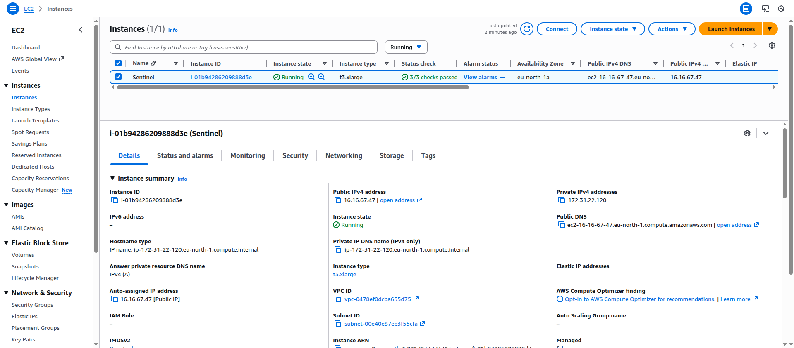

# AWS EC2 Deployment Guide

## Quick Start (Recommended)

### Prerequisites
- AWS EC2 instance (Ubuntu 20.04 or Amazon Linux 2)
- Security Group with port 80 open
- SSH access with `.pem` key

<p align="center">
  <a href="../assets/screenshots/aws_console.png" target="_blank" rel="noopener">
    
  </a>
</p>

### One-Command Setup

```bash
# SSH into EC2
ssh -i sentinel.pem ec2-user@EC2_IP

# Install dependencies
sudo apt update
sudo apt install git
sudo apt install -y ca-certificates curl gnupg lsb-release

curl -fsSL https://get.docker.com | sudo bash

sudo usermod -aG docker $USER
newgrp docker

# Clone and setup
git clone https://github.com/rohansen856/elk-stack-monitoring.git
cd elk-stack-monitoring
chmod +x aws-ec2-setup.sh
./aws-ec2-setup.sh
```

That's it! The script will:
1. Auto-detect EC2 public IP
2. Configure all `.env` files
3. Build Docker images
4. Start all services
5. Verify everything is working

### Access Application

After setup completes:
- **Frontend**: `http://EC2_IP/frontend`
- **Backend API**: `http://EC2_IP/backend/docs`
- **Kibana**: `http://EC2_IP/monitoring`

## Manual Setup (If Automated Fails)

### Step 1: Install Dependencies

```bash
# Install dependencies
sudo apt update
sudo apt install git
sudo apt install -y ca-certificates curl gnupg lsb-release

curl -fsSL https://get.docker.com | sudo bash

sudo usermod -aG docker $USER
newgrp docker
```

### Step 2: Clone Repository

```bash
git clone https://github.com/rohansen856/elk-stack-monitoring.git
cd elk-stack-monitoring
```

### Step 3: Configure Environment

```bash
# Copy environment files
cp .env.example .env
cp website/.env.example website/.env

# Get EC2 public IP using IMDSv2 (required for modern EC2 instances)
TOKEN=$(curl -s -X PUT "http://169.254.169.254/latest/api/token" \
  -H "X-aws-ec2-metadata-token-ttl-seconds: 21600")

EC2_IP=$(curl -s -H "X-aws-ec2-metadata-token: $TOKEN" \
  http://169.254.169.254/latest/meta-data/public-ipv4)

echo  EC2 IP: $EC2_IP"

# Update frontend environment (CRITICAL STEP)
sed -i "s|http://localhost/frontend|http://$EC2_IP/frontend|g" website/.env

# Verify the change
cat website/.env | grep NEXT_PUBLIC_APP_URL
# Should show: NEXT_PUBLIC_APP_URL=http://EC2_IP/frontend
```

### Step 4: Build and Start

```bash
# Build containers (this takes 5-10 minutes)
docker compose build --no-cache

# Start services
docker compose up -d
```

- Check status after some time:
```bash
# Check status
docker compose ps
```

All services should show as "running" or "healthy".

### Step 5: Verify

```bash
# Test backend
curl http://localhost/backend/health
# Should return: {"status":"healthy",...}

# Test Kibana
curl -I http://localhost/monitoring/api/status
# Should return: HTTP/1.1 200 OK

# Test nginx
curl http://localhost/nginx-health
# Should return: healthy
```

## Monitoring

### View Logs

```bash
# All services
docker compose logs -f

# Specific service
docker compose logs -f frontend
docker compose logs -f app
docker compose logs -f nginx
```

### Check Service Health

```bash
# Quick status
docker compose ps

# Detailed health
curl http://localhost/backend/health
curl http://localhost/monitoring/api/status
curl http://localhost/nginx-health
```

### Restart Services

```bash
# Restart specific service
docker compose restart frontend

# Restart all
docker compose restart

# Stop all
docker compose down

# Start all
docker compose up -d
```

## Support

- **Documentation**: [docs/](docs/)
- **Issues**: Create an issue on GitHub
- **Security**: See [SECURITY_CREDENTIALS.md](docs/SECURITY_CREDENTIALS.md)
