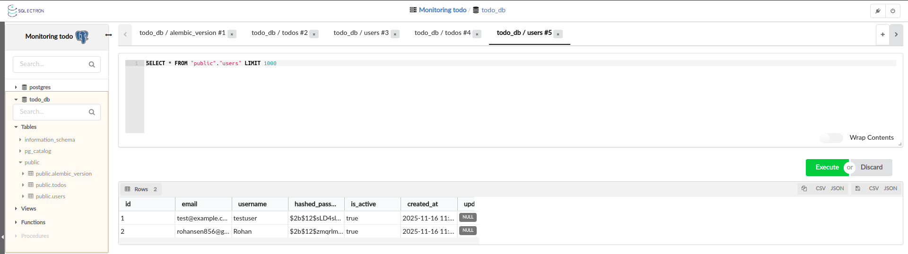
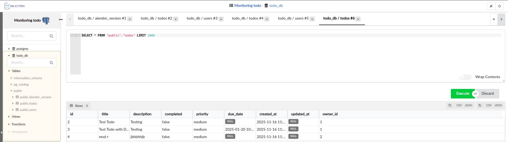

# Database Architecture Guide

## 🏗️ Database Overview

Our system uses a **three-layer database architecture** that works like a well-organized team:

- **PostgreSQL** = The permanent storage warehouse (keeps everything safe forever)
- **Redis** = The quick-access memory (remembers recent stuff for speed)
- **FastAPI** = The smart coordinator (decides where to get/store data)

```
👤 User Request
    ↓
🌐 FastAPI (Smart Coordinator)
    ↓
🚀 Redis (Quick Memory) ←→ 🏛️ PostgreSQL (Permanent Storage)
    ↓
📊 Response to User
```

## 🏛️ PostgreSQL - The Permanent Storage Warehouse

### What is PostgreSQL?

PostgreSQL is like a **massive, organized warehouse** where we keep all important information permanently. Even if the power goes out, everything stays safe.

### Database Schema

Our PostgreSQL database has two main tables:

#### 👤 Users Table
```sql
CREATE TABLE users (
    id SERIAL PRIMARY KEY,              -- Unique ID for each user
    email VARCHAR(255) UNIQUE NOT NULL, -- User's email (must be unique)
    username VARCHAR(50) UNIQUE NOT NULL, -- Username (must be unique)
    hashed_password VARCHAR(255) NOT NULL, -- Encrypted password
    is_active BOOLEAN DEFAULT TRUE,     -- Is account active?
    created_at TIMESTAMP DEFAULT NOW(), -- When account was created
    updated_at TIMESTAMP DEFAULT NOW()  -- When account was last modified
);

-- Example data:
-- id=1, email="john@example.com", username="john_doe"
-- id=2, email="jane@example.com", username="jane_smith"
```
<p align="center">
  <a href="../assets/screenshots/todo_db_users_schema.png" target="_blank" rel="noopener">
    
  </a>
</p>

_Figure: PostgreSQL "users" table schema diagram._

#### 📝 Todos Table
```sql
CREATE TABLE todos (
    id SERIAL PRIMARY KEY,              -- Unique ID for each todo
    title VARCHAR(200) NOT NULL,        -- Todo title
    description TEXT,                   -- Detailed description
    completed BOOLEAN DEFAULT FALSE,    -- Is todo finished?
    priority VARCHAR(10) DEFAULT 'medium', -- low, medium, high
    due_date TIMESTAMP,                 -- When is it due?
    created_at TIMESTAMP DEFAULT NOW(), -- When was it created?
    updated_at TIMESTAMP DEFAULT NOW(), -- When was it last changed?
    owner_id INTEGER REFERENCES users(id) ON DELETE CASCADE -- Who owns it?
);

-- Example data:
-- id=1, title="Buy groceries", owner_id=1, completed=false
-- id=2, title="Finish project", owner_id=1, completed=true
```
<p align="center">
  <a href="../assets/screenshots/todo_db_todos_schema.png" target="_blank" rel="noopener">
    
  </a>
</p>

_Figure: PostgreSQL "todos" table schema diagram._

#### 🔗 Relationship Between Tables
```
Users (1) ←→ (Many) Todos
One user can have many todos
Each todo belongs to exactly one user

User John (id=1) has:
├── Todo 1: "Buy groceries"
├── Todo 2: "Walk the dog"
└── Todo 3: "Finish homework"
```

### Configuration

```yaml
# From docker-compose.yml
db:
  image: postgres:15-alpine
  environment:
    POSTGRES_DB: todo_db
    POSTGRES_USER: user
    POSTGRES_PASSWORD: password
  ports:
    - "5432:5432"
  volumes:
    - postgres_data:/var/lib/postgresql/data
```

### Connection Configuration

```python
# From app/config.py
DATABASE_URL = "postgresql://user:password@db:5432/todo_db"

# SQLAlchemy connection
from sqlalchemy import create_engine
engine = create_engine(DATABASE_URL)
```

## 🚀 Redis - The Speed Demon

### What is Redis?

Redis is like **super-fast sticky notes** that the computer can read instantly. We use it to remember things temporarily so we don't have to ask PostgreSQL every time.

### What We Store in Redis

```
🔐 USER SESSIONS
Key: "session:user_123"
Value: {"user_id": 123, "expires": "2024-01-16T10:00:00Z"}
TTL: 30 minutes

📊 CACHED STATISTICS
Key: "stats:user_123:todos"
Value: {"total": 25, "completed": 18, "pending": 7}
TTL: 5 minutes

🔍 SEARCH RESULTS
Key: "search:user_123:groceries"
Value: [{"id": 1, "title": "Buy groceries"}, ...]
TTL: 10 minutes

⚡ FREQUENTLY ACCESSED DATA
Key: "user:123:profile"
Value: {"username": "john_doe", "email": "john@example.com"}
TTL: 1 hour
```

### Redis Data Types Used

| Data Type | Use Case | Example |
|-----------|----------|---------|
| **String** | Simple cache values | User profiles, settings |
| **Hash** | Complex objects | Todo details, user metadata |
| **List** | Ordered collections | Recent activities, logs |
| **Set** | Unique collections | User permissions, tags |
| **Sorted Set** | Ranked data | Top users, priority todos |
| **Expiry (TTL)** | Automatic cleanup | All cached data expires |

### Configuration

```yaml
# From docker-compose.yml
redis:
  image: redis:7-alpine
  ports:
    - "6379:6379"
  volumes:
    - redis_data:/data
  command: redis-server --appendonly yes
```

### Redis Connection

```python
# From app/cache.py
import redis
from app.config import settings

redis_client = redis.Redis(
    host=settings.redis_host,
    port=settings.redis_port,
    decode_responses=True
)
```

## 🌐 FastAPI - The Smart Coordinator

### What is FastAPI's Role?

FastAPI acts like a **smart traffic controller** that decides:
- Should I check Redis first (for speed)?
- Do I need to ask PostgreSQL (for complete data)?
- Should I update both databases?

### Database Interaction Patterns

#### 1. Read Pattern (Getting Data)
```python
async def get_user_todos(user_id: int):
    # Step 1: Check Redis first (fast!)
    cache_key = f"todos:user_{user_id}"
    cached_todos = redis_client.get(cache_key)

    if cached_todos:
        return json.loads(cached_todos)  # Return from cache

    # Step 2: If not in cache, ask PostgreSQL
    todos = db.query(Todo).filter(Todo.owner_id == user_id).all()

    # Step 3: Save to Redis for next time
    redis_client.setex(
        cache_key,
        300,  # 5 minutes
        json.dumps([todo.dict() for todo in todos])
    )

    return todos
```

#### 2. Write Pattern (Saving Data)
```python
async def create_todo(user_id: int, todo_data: dict):
    # Step 1: Save to PostgreSQL (permanent storage)
    new_todo = Todo(**todo_data, owner_id=user_id)
    db.add(new_todo)
    db.commit()
    db.refresh(new_todo)

    # Step 2: Update Redis cache
    cache_key = f"todos:user_{user_id}"
    redis_client.delete(cache_key)  # Clear old cache

    # Step 3: Update statistics cache
    stats_key = f"stats:user_{user_id}"
    redis_client.delete(stats_key)  # Will be recalculated next time

    return new_todo
```

#### 3. Authentication Pattern
```python
async def login_user(email: str, password: str):
    # Step 1: Check PostgreSQL for user
    user = db.query(User).filter(User.email == email).first()

    if user and verify_password(password, user.hashed_password):
        # Step 2: Create session in Redis
        session_token = generate_token()
        session_data = {
            "user_id": user.id,
            "username": user.username,
            "expires": datetime.utcnow() + timedelta(minutes=30)
        }

        redis_client.setex(
            f"session:{session_token}",
            1800,  # 30 minutes
            json.dumps(session_data)
        )

        return session_token

    raise HTTPException(401, "Invalid credentials")
```

## 🔄 Data Flow Examples

### Example 1: User Logs In and Views Todos

```
1. USER LOGS IN
   ↓
   FastAPI checks PostgreSQL for user credentials
   ↓
   If valid, FastAPI creates session in Redis
   ↓
   Returns authentication token to user

2. USER REQUESTS TODOS
   ↓
   FastAPI checks Redis for "todos:user_123"
   ↓
   If found: Return from Redis (super fast!)
   If not found: Query PostgreSQL → Cache in Redis → Return

3. USER CREATES NEW TODO
   ↓
   FastAPI saves to PostgreSQL (permanent)
   ↓
   FastAPI clears Redis cache (so it gets fresh data next time)
   ↓
   Returns success to user
```

### Example 2: System Statistics Dashboard

```
1. REQUEST FOR STATISTICS
   ↓
   FastAPI checks Redis for "stats:global:dashboard"
   ↓
   If cached (less than 5 minutes old): Return from Redis

   If not cached:
   ↓
   Query PostgreSQL:
   - COUNT(*) FROM users
   - COUNT(*) FROM todos WHERE completed = true
   - COUNT(*) FROM todos WHERE created_at > NOW() - INTERVAL '24 hours'
   ↓
   Calculate percentages and trends
   ↓
   Store results in Redis with 5-minute expiry
   ↓
   Return statistics to user
```

## 🔧 Database Operations Through FastAPI

### User Management Operations

```python
# Create new user
POST /api/v1/users/register
│
├── Validate input data
├── Hash password with bcrypt
├── Save to PostgreSQL users table
├── Cache user profile in Redis
└── Return user info (without password)

# User login
POST /api/v1/users/login
│
├── Find user in PostgreSQL
├── Verify password
├── Create session in Redis
└── Return JWT token

# Get user profile
GET /api/v1/users/me
│
├── Validate JWT token
├── Check Redis for "user:123:profile"
├── If not cached: Query PostgreSQL + Cache result
└── Return user profile
```

### Todo Management Operations

```python
# Get all todos for user
GET /api/v1/todos/
│
├── Extract user_id from JWT
├── Check Redis cache "todos:user_123"
├── If cache miss: Query PostgreSQL + Update cache
└── Return todo list

# Create new todo
POST /api/v1/todos/
│
├── Validate todo data
├── Save to PostgreSQL todos table
├── Clear user's todo cache in Redis
├── Update todo statistics cache
└── Return created todo

# Update todo
PUT /api/v1/todos/{todo_id}
│
├── Verify user owns the todo (PostgreSQL)
├── Update todo in PostgreSQL
├── Clear relevant Redis caches
└── Return updated todo

# Delete todo
DELETE /api/v1/todos/{todo_id}
│
├── Verify user owns the todo
├── Delete from PostgreSQL
├── Clear user's todo cache
├── Update statistics cache
└── Return success message
```

## 📊 Performance Optimization

### Caching Strategy

```python
class CacheManager:
    def __init__(self, redis_client):
        self.redis = redis_client

    async def get_or_set(self, key: str, fetch_function, ttl: int = 300):
        """Get from cache or fetch and cache"""
        # Try cache first
        cached = self.redis.get(key)
        if cached:
            return json.loads(cached)

        # Fetch from database
        data = await fetch_function()

        # Cache the result
        self.redis.setex(key, ttl, json.dumps(data))
        return data

# Usage
todos = await cache_manager.get_or_set(
    f"todos:user_{user_id}",
    lambda: fetch_todos_from_db(user_id),
    ttl=300  # 5 minutes
)
```

### Database Connection Optimization

```python
# SQLAlchemy connection pooling
from sqlalchemy import create_engine
from sqlalchemy.pool import QueuePool

engine = create_engine(
    DATABASE_URL,
    poolclass=QueuePool,
    pool_size=20,        # Keep 20 connections open
    max_overflow=30,     # Allow 30 additional connections
    pool_pre_ping=True,  # Validate connections before use
    pool_recycle=3600    # Recycle connections every hour
)
```

## 🔐 Security Considerations

### Password Security
```python
# Password hashing with bcrypt
from passlib.context import CryptContext

pwd_context = CryptContext(schemes=["bcrypt"], deprecated="auto")

def hash_password(password: str) -> str:
    return pwd_context.hash(password)

def verify_password(plain_password: str, hashed_password: str) -> bool:
    return pwd_context.verify(plain_password, hashed_password)
```

### Session Management
```python
# Secure session handling
def create_session(user_id: int) -> str:
    session_token = secrets.token_urlsafe(32)
    session_data = {
        "user_id": user_id,
        "created_at": datetime.utcnow().isoformat(),
        "expires_at": (datetime.utcnow() + timedelta(minutes=30)).isoformat()
    }

    redis_client.setex(
        f"session:{session_token}",
        1800,  # 30 minutes
        json.dumps(session_data)
    )

    return session_token
```

### Database Access Control
```python
# Environment-based database configuration
class Settings(BaseSettings):
    database_url: str = Field(..., env="DATABASE_URL")
    redis_url: str = Field(..., env="REDIS_URL")
    secret_key: str = Field(..., env="SECRET_KEY")

    class Config:
        env_file = ".env"
        case_sensitive = False
```

## 📈 Monitoring and Health Checks

### Database Health Monitoring

```python
@app.get("/health")
async def health_check():
    health_status = {
        "status": "healthy",
        "timestamp": datetime.utcnow().isoformat(),
        "services": {}
    }

    # Check PostgreSQL
    try:
        with engine.connect() as conn:
            conn.execute("SELECT 1")
        health_status["services"]["database"] = "ok"
    except Exception as e:
        health_status["services"]["database"] = f"error: {str(e)}"
        health_status["status"] = "unhealthy"

    # Check Redis
    try:
        redis_client.ping()
        health_status["services"]["redis"] = "ok"
    except Exception as e:
        health_status["services"]["redis"] = f"error: {str(e)}"
        health_status["status"] = "unhealthy"

    return health_status
```

### Performance Metrics

```python
# Database query timing
import time
from functools import wraps

def time_db_query(func):
    @wraps(func)
    async def wrapper(*args, **kwargs):
        start_time = time.time()
        result = await func(*args, **kwargs)
        query_time = time.time() - start_time

        # Log slow queries
        if query_time > 1.0:  # Queries taking more than 1 second
            logger.warning(f"Slow query detected: {func.__name__} took {query_time:.2f}s")

        return result
    return wrapper
```

## 🛠️ Migration Management

### Database Migrations with Alembic

```bash
# Create a new migration
alembic revision --autogenerate -m "Add user preferences table"

# Apply migrations
alembic upgrade head

# View migration history
alembic history

# Rollback to previous version
alembic downgrade -1
```

### Example Migration File

```python
# alembic/versions/001_create_users_table.py
def upgrade():
    op.create_table(
        'users',
        sa.Column('id', sa.Integer, primary_key=True),
        sa.Column('email', sa.String(255), unique=True, nullable=False),
        sa.Column('username', sa.String(50), unique=True, nullable=False),
        sa.Column('hashed_password', sa.String(255), nullable=False),
        sa.Column('is_active', sa.Boolean, default=True),
        sa.Column('created_at', sa.DateTime, default=func.now()),
        sa.Column('updated_at', sa.DateTime, default=func.now(), onupdate=func.now())
    )

def downgrade():
    op.drop_table('users')
```

This database architecture provides a robust, scalable, and secure foundation for the threat detection system, balancing performance (through Redis caching) with data durability (through PostgreSQL) while maintaining security best practices throughout all data operations.