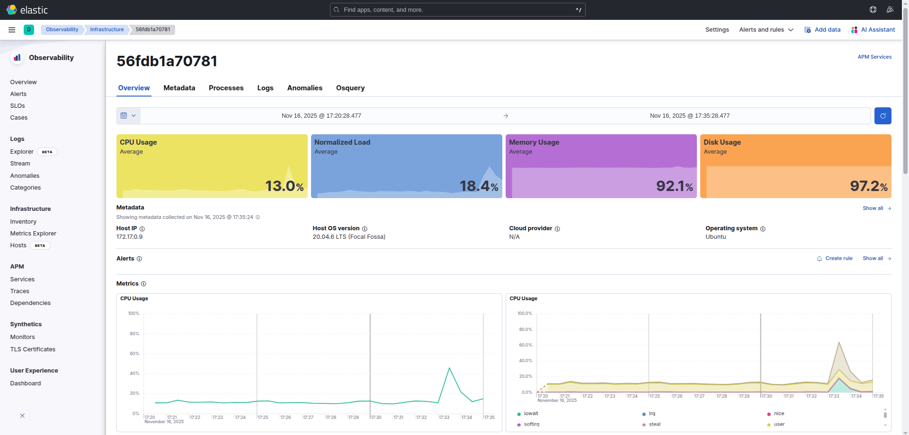

# Kibana Deep Dive Guide

<p align="center">
  <a href="../assets/images/kibana_host_details.png" target="_blank" rel="noopener">
    
  </a>
</p>

## 📊 What is Kibana?

Kibana is like a **master storyteller** who takes millions of security events stored in Elasticsearch and creates beautiful, interactive visual stories that help you understand what's happening in your network. Think of it as the **Netflix for your security data** - it makes complex information engaging and easy to understand.

Kibana transforms raw security data into:
- 🌍 Interactive world maps showing attack sources
- 📈 Real-time charts of threat trends
- 🎯 Customizable dashboards for security operations
- 🔍 Powerful search interfaces for threat hunting
- 🚨 Visual alerts and notifications

## 🎨 Kibana Architecture and Components

### Core Applications

```
📊 KIBANA PLATFORM
├── 🔍 Discover (Data Exploration)
├── 📈 Visualize (Chart Creation)
├── 📋 Dashboard (Operational Views)
├── 🌍 Maps (Geographic Analysis)
├── 🎨 Canvas (Presentation Mode)
├── 📊 Lens (Easy Visualization)
├── 🚨 Alerting (Monitoring & Notifications)
├── ⚙️ Stack Management (Administration)
└── 🛠️ Dev Tools (API Testing)
```

### Security Operations Center (SOC) Layout

```
┌─────────────────────────────────────────────────────────────┐
│                    🛡️ SECURITY DASHBOARD                    │
├─────────────────────────────────────────────────────────────┤
│  📊 Real-time Metrics     │  🌍 Geographic Threat Map       │
│  ├── Total Alerts: 1,247  │     🔴 High-risk sources        │
│  ├── High Risk: 23        │     🟡 Medium-risk sources      │
│  ├── Countries: 15        │     🟢 Low-risk sources         │
│  └── Active Users: 156    │                                 │
├─────────────────────────────────────────────────────────────┤
│  📈 Attack Timeline       │  🎯 Top Threats                 │
│     ▄▄   ▄▄▄    ▄         │  1. Brute Force (🇨🇳): 45        │
│   ▄▄██ ▄▄███  ▄▄█ ▄▄      │  2. Port Scan (🇷🇺): 32          │
│ ▄▄████▄██████▄███▄██▄▄    │  3. Web Attack (🇺🇸): 28         │
├─────────────────────────────────────────────────────────────┤
│  🔍 Recent Alerts         │  📋 Investigation Queue         │
│  ⚠️ 14:30 Brute Force     │  1. Review admin account        │
│  🚨 14:25 Data Exfil      │  2. Block suspicious IPs        │
│  ⚠️ 14:20 PowerShell      │  3. Update firewall rules       │
└─────────────────────────────────────────────────────────────┘
```

## 🔧 Configuration in Our System

### Docker Configuration
```yaml
# From docker-compose.yml
kibana:
  image: docker.elastic.co/kibana/kibana:8.11.0
  container_name: kibana
  environment:
    # Elasticsearch connection
    - ELASTICSEARCH_HOSTS=http://elasticsearch:9200

    # Logging configuration
    - LOGGING_ROOT_LEVEL=warn
    - LOGGING_LOGGERS_HTTP_LEVEL=warn

    # Security keys for saved objects encryption
    - XPACK_ENCRYPTEDSAVEDOBJECTS_ENCRYPTIONKEY=a7a6311933d3503b89bc8d0a98d7e6f8d4c5e7f8a9b3c2d1e5f6g7h8i9j0k1l2
    - XPACK_REPORTING_ENCRYPTIONKEY=b8b7412844e4614c9acde1b1ac8ef7g9e5d6f8g9bac4d3e2f6g7h8i9j0k1l2m3n4
    - XPACK_SECURITY_ENCRYPTIONKEY=c9c8523955f5725dabe2c2bd9f0g8ha6f7e8g9hacb5e4f3g7h8i9j0k1l2m3n4o5p6

  # Web interface port
  ports:
    - "5601:5601"

  # Dependencies
  depends_on:
    elasticsearch:
      condition: service_healthy

  # Health check
  healthcheck:
    test: ["CMD-SHELL", "curl -f http://localhost:5601/api/status || exit 1"]
    interval: 30s
    timeout: 10s
    retries: 5

  # Environment file for additional config
  env_file:
    - ./.env
```

### Kibana Configuration File
```yaml
# config/kibana.yml (if using custom configuration)
server:
  host: "0.0.0.0"
  port: 5601
  name: "threat-detection-kibana"

elasticsearch:
  hosts: ["http://elasticsearch:9200"]
  requestTimeout: 60000
  shardTimeout: 30000

# Monitoring
monitoring:
  ui:
    container:
      elasticsearch:
        enabled: true

# Security (for production)
xpack:
  security:
    enabled: true
  encryptedSavedObjects:
    encryptionKey: "your-32-character-encryption-key"
```

## 🔍 Setting Up Security Index Patterns

### Creating Index Patterns (First-Time Setup)

#### 1. Security Authentication Logs
```
Navigation: Stack Management → Index Patterns → Create Index Pattern

Index Pattern: security-auth-logs-*
Time Field: @timestamp
Description: Authentication events (logins, logouts, failed attempts)

Sample Fields:
- @timestamp (date)
- src_ip (ip)
- user_name (keyword)
- event_type (keyword)
- risk_score (number)
- geo.country (keyword)
- geo.location (geo_point)
```

#### 2. Security Network Logs
```
Index Pattern: security-network-logs-*
Time Field: @timestamp
Description: Network events (firewall, connections, traffic)

Sample Fields:
- @timestamp (date)
- src_ip, dst_ip (ip)
- src_port, dst_port (number)
- protocol (keyword)
- bytes (number)
- action (keyword)
```

#### 3. Security Alerts
```
Index Pattern: security-alerts-*
Time Field: @timestamp
Description: Detected threats and security alerts

Sample Fields:
- @timestamp (date)
- alert_type (keyword)
- severity (keyword)
- confidence (number)
- evidence (object)
- mitre_attack.technique (keyword)
```

#### 4. All Security Data (Unified View)
```
Index Pattern: security-*
Time Field: @timestamp
Description: All security-related events and alerts

This pattern captures all security indices for unified analysis
```

## 📊 Building Security Visualizations

### 1. Geographic Threat Map

#### Creating a Coordinate Map
```
Visualization Type: Maps
Data Source: security-*

Layer Configuration:
- Layer Type: Documents
- Index Pattern: security-*
- Geospatial Field: geo.location

Metrics:
- Aggregation: Count
- Label: Attack Count

Filters:
- risk_score >= 5
- @timestamp: Last 24 hours

Tooltip Fields:
- src_ip
- geo.country
- risk_score
- event_type

Color Coding:
- Green (1-3): Low risk
- Yellow (4-6): Medium risk
- Red (7-10): High risk
```

#### Advanced Map Features
```json
// Custom map styling
{
  "version": 8,
  "sources": {
    "threats": {
      "type": "geojson",
      "data": {
        "type": "FeatureCollection",
        "features": []
      }
    }
  },
  "layers": [
    {
      "id": "threat-circles",
      "type": "circle",
      "source": "threats",
      "paint": {
        "circle-radius": [
          "case",
          [">=", ["get", "risk_score"], 8], 15,
          [">=", ["get", "risk_score"], 5], 10,
          5
        ],
        "circle-color": [
          "case",
          [">=", ["get", "risk_score"], 8], "#ff0000",
          [">=", ["get", "risk_score"], 5], "#ffaa00",
          "#00ff00"
        ],
        "circle-opacity": 0.7
      }
    }
  ]
}
```

### 2. Attack Timeline Visualization

#### Line Chart for Threat Trends
```
Visualization Type: Line Chart (Lens)
Data Source: security-*

X-Axis:
- Field: @timestamp
- Interval: 1 hour
- Time Range: Last 24 hours

Y-Axis:
- Aggregation: Count of events
- Filter: risk_score >= 5

Series Breakdown:
- Split by: event_type.keyword
- Top 5 values

Configuration:
- Show legend: Yes
- Smooth lines: Yes
- Fill area: 0.3 opacity
- Grid lines: Both axes
```

#### Heatmap for Time-based Analysis
```
Visualization Type: Heat Map
Data Source: security-*

X-Axis (Buckets):
- Aggregation: Date Histogram
- Field: @timestamp
- Interval: 1 hour

Y-Axis (Buckets):
- Aggregation: Terms
- Field: geo.country.keyword
- Size: 10

Metrics:
- Aggregation: Count
- Custom Label: "Attack Count"

Options:
- Color Schema: Reds (for threats)
- Labels: Show labels
- Percentile Mode: No
```

### 3. Risk Score Distribution

#### Gauge for Current Risk Level
```
Visualization Type: Gauge
Data Source: security-*

Metrics:
- Aggregation: Average
- Field: risk_score
- Custom Label: "Current Risk Level"

Time Range: Last 15 minutes

Gauge Options:
- Color Ranges:
  - 0-3: Green (Low)
  - 4-6: Yellow (Medium)
  - 7-8: Orange (High)
  - 9-10: Red (Critical)
- Show Goal: No
- Arc Display: Full
```

#### Donut Chart for Risk Distribution
```
Visualization Type: Donut Chart (Lens)
Data Source: security-*

Slice By:
- Field: risk_score
- Function: Terms
- Custom ranges:
  - Low: 1-3
  - Medium: 4-6
  - High: 7-8
  - Critical: 9-10

Metrics:
- Count of events

Configuration:
- Show legend: Yes
- Legend position: Right
- Show percentages: Yes
```

### 4. Top Threats Table

#### Data Table with Threat Details
```
Visualization Type: Data Table
Data Source: security-alerts-*

Columns:
1. @timestamp (Top Hit)
   - Sort: Descending
   - Size: 1

2. alert_type.keyword (Terms)
   - Size: 10

3. src_ip.keyword (Terms)
   - Size: 1

4. geo.country.keyword (Terms)
   - Size: 1

5. confidence (Average)

6. Actions (Custom)
   - URL template for investigation

Pagination: 20 rows per page
Export options: CSV, PDF
```

## 🎯 Creating Security Dashboards

### Dashboard import
```bash
# If you have a .json file, convert it to .ndjson
# Each object should be on a separate line

cat kibana/dashboards/apt-detection-dashboard.json | jq -c '.objects[]?' > apt-detection-dashboard.ndjson
```

### 1. Executive Security Dashboard

#### Dashboard Layout
```
Dashboard Name: "Executive Security Overview"
Refresh Interval: 5 minutes
Time Range: Last 24 hours

Grid Layout (4x4):
┌─────────────────────────────────────────────────┐
│ KPI Metrics (2x1)     │ Geographic Map (2x2)    │
│ - Total Alerts        │                         │
│ - High Risk Events    │                         │
├─────────────────────────────────────────────────┤
│ Attack Timeline (4x1)                           │
│ (Line chart showing 24h trend)                  │
├─────────────────────────────────────────────────┤
│ Top Countries (1x2)   │ Risk Distribution (1x2) │
│ (Bar chart)           │ (Donut chart)           │
└─────────────────────────────────────────────────┘
```

#### KPI Metrics Configuration
```json
// Metric visualizations for key indicators
{
  "total_alerts": {
    "type": "metric",
    "query": {
      "bool": {
        "filter": [
          {"range": {"@timestamp": {"gte": "now-24h"}}},
          {"range": {"risk_score": {"gte": 5}}}
        ]
      }
    },
    "aggregations": {
      "alert_count": {"value_count": {"field": "risk_score"}}
    }
  },
  "critical_threats": {
    "type": "metric",
    "query": {
      "bool": {
        "filter": [
          {"range": {"@timestamp": {"gte": "now-24h"}}},
          {"range": {"risk_score": {"gte": 9}}}
        ]
      }
    }
  }
}
```

### 2. SOC Analyst Dashboard

#### Operational View Layout
```
Dashboard Name: "SOC Operations Dashboard"
Refresh Interval: 1 minute
Time Range: Last 4 hours

Layout:
┌─────────────────────────────────────────────────┐
│ Real-time Alerts Feed (4x1)                     │
│ (Data table with live updates)                  │
├─────────────────────────────────────────────────┤
│ Threat Map (2x2)      │ Event Timeline (2x2)    │
│                       │                         │
├─────────────────────────────────────────────────┤
│ Failed Logins (2x1)   │ Network Blocks (2x1)    │
│ (by source IP)        │ (by destination)        │
├─────────────────────────────────────────────────┤
│ PowerShell Activity   │ File Access Events      │
│ (1x1)                 │ (1x1)                   │
└─────────────────────────────────────────────────┘
```

### 3. Threat Hunting Dashboard

#### Investigation-Focused Layout
```
Dashboard Name: "Threat Hunting Workspace"
Refresh Interval: Manual
Time Range: Configurable (default: last 7 days)

Sections:
1. Search Bar (Custom queries)
2. Timeline Analysis (detailed hourly breakdown)
3. User Behavior Analysis
4. Network Communication Patterns
5. File Access Patterns
6. Process Execution Analysis
```

## 🔍 Advanced Search and Discovery

### Discover Application Features

#### 1. Basic Search Queries
```
// Simple text search
event_type: "authentication_failure"

// Boolean queries
event_type: "authentication_failure" AND risk_score: [7 TO 10]

// Wildcard searches
user_name: admin*

// Range queries
@timestamp: [now-1h TO now] AND risk_score: >=8

// Field existence
_exists_: geo.country AND NOT geo.country: "Unknown"
```

#### 2. Advanced KQL (Kibana Query Language)
```
// Failed logins from external IPs
event_type: "authentication_failure" AND NOT src_ip: (192.168.* OR 10.* OR 172.16.*)

// PowerShell with suspicious patterns
log_category: "powershell" AND (command_line: *EncodedCommand* OR command_line: *DownloadString*)

// Multiple failed attempts followed by success
(event_type: "authentication_failure" OR event_type: "authentication_success") AND src_ip: 203.0.113.42

// High-risk events in business hours
risk_score: [7 TO 10] AND @timestamp: [now/d+9h TO now/d+17h]
```

#### 3. Saved Searches for Common Investigations
```
// Brute Force Investigation
Name: "Brute Force Attempts"
Query: event_type: "authentication_failure" AND risk_score: >=7
Fields: @timestamp, src_ip, user_name, risk_score, geo.country
Time: Last 24 hours

// Data Exfiltration
Name: "Large Data Transfers"
Query: event_type: "data_transfer" AND bytes: >104857600
Fields: @timestamp, src_ip, dst_ip, bytes, protocol
Time: Last 7 days

// Privileged Account Activity
Name: "Admin Account Usage"
Query: user_name: (admin OR root OR administrator) AND event_type: "authentication_success"
Fields: @timestamp, user_name, src_ip, geo.country, session_duration
Time: Last 30 days
```

## 🚨 Alerting and Monitoring

### Setting Up Security Alerts

#### 1. Brute Force Attack Alert
```json
{
  "name": "Brute Force Attack Detected",
  "consumer": "alerts",
  "enabled": true,
  "schedule": {
    "interval": "1m"
  },
  "rule_type_id": ".es-query",
  "params": {
    "index": ["security-auth-logs-*"],
    "timeField": "@timestamp",
    "esQuery": {
      "query": {
        "bool": {
          "filter": [
            {
              "range": {
                "@timestamp": {
                  "gte": "now-5m"
                }
              }
            },
            {
              "term": {
                "event_type": "authentication_failure"
              }
            }
          ]
        }
      },
      "aggs": {
        "by_ip": {
          "terms": {
            "field": "src_ip",
            "size": 100
          }
        }
      }
    },
    "threshold": [5],
    "thresholdComparator": ">="
  },
  "actions": [
    {
      "id": "slack-action",
      "group": "threshold met",
      "params": {
        "message": "🚨 Brute force attack detected from IP: {{context.value}}\nFailed attempts: {{context.hits.total}}\nTime: {{context.date}}"
      }
    }
  ]
}
```

#### 2. High-Risk Event Alert
```json
{
  "name": "Critical Security Event",
  "consumer": "alerts",
  "enabled": true,
  "schedule": {
    "interval": "30s"
  },
  "rule_type_id": ".es-query",
  "params": {
    "index": ["security-*"],
    "timeField": "@timestamp",
    "esQuery": {
      "query": {
        "bool": {
          "filter": [
            {
              "range": {
                "@timestamp": {
                  "gte": "now-1m"
                }
              }
            },
            {
              "range": {
                "risk_score": {
                  "gte": 9
                }
              }
            }
          ]
        }
      }
    },
    "threshold": [1],
    "thresholdComparator": ">="
  },
  "actions": [
    {
      "id": "email-action",
      "group": "threshold met",
      "params": {
        "to": ["security-team@company.com"],
        "subject": "🔥 CRITICAL: High-Risk Security Event Detected",
        "message": "A critical security event has been detected:\n\nRisk Score: {{context.hits.hits.0._source.risk_score}}\nEvent Type: {{context.hits.hits.0._source.event_type}}\nSource IP: {{context.hits.hits.0._source.src_ip}}\nTime: {{context.date}}\n\nPlease investigate immediately."
      }
    }
  ]
}
```

### Watcher Alerts (Advanced)
```json
// Custom watcher for APT detection
{
  "trigger": {
    "schedule": {
      "interval": "5m"
    }
  },
  "input": {
    "search": {
      "request": {
        "indices": ["security-*"],
        "body": {
          "query": {
            "bool": {
              "filter": [
                {"range": {"@timestamp": {"gte": "now-1h"}}},
                {"terms": {"event_type": ["authentication_failure", "privilege_escalation", "data_exfiltration"]}}
              ]
            }
          },
          "aggs": {
            "by_ip": {
              "terms": {"field": "src_ip"},
              "aggs": {
                "event_types": {
                  "terms": {"field": "event_type"}
                }
              }
            }
          }
        }
      }
    }
  },
  "condition": {
    "array_path": "ctx.payload.aggregations.by_ip.buckets",
    "path": "doc_count",
    "gte": {
      "value": 3
    }
  },
  "actions": {
    "send_slack": {
      "slack": {
        "message": {
          "to": "#security-alerts",
          "text": "🔥 Potential APT Activity Detected\nMultiple attack stages from same IP: {{ctx.payload.aggregations.by_ip.buckets.0.key}}\nEvent count: {{ctx.payload.aggregations.by_ip.buckets.0.doc_count}}"
        }
      }
    }
  }
}
```

## 🎨 Canvas for Executive Presentations

### Creating Security Briefing Canvas

#### Executive Summary Slide
```
Canvas Name: "Weekly Security Briefing"
Slide Dimensions: 1920x1080 (16:9)

Elements:
1. Header (Company Logo + Date)
2. Key Metrics (Cards with large numbers)
   - Total Events: 1,247,832
   - Threats Blocked: 3,456
   - Risk Score: 4.2/10
   - Incidents: 7

3. Geographic Distribution (World map)
4. Trend Analysis (Line charts)
5. Action Items (Text with priorities)

Filters:
- Time range picker
- Severity filter
- Geography filter
```

#### Canvas Configuration
```json
{
  "workpad": {
    "name": "Security Executive Dashboard",
    "width": 1920,
    "height": 1080,
    "pages": [
      {
        "elements": [
          {
            "type": "metric",
            "position": {"top": 100, "left": 100, "width": 300, "height": 150},
            "expression": "essql query=\"SELECT COUNT(*) as total_events FROM security-* WHERE @timestamp >= NOW() - INTERVAL 7 DAY\" | metric \"Total Events\" metricFont={font size=48 family=\"Arial\"}"
          },
          {
            "type": "plot",
            "position": {"top": 300, "left": 100, "width": 800, "height": 400},
            "expression": "essql query=\"SELECT @timestamp, COUNT(*) as events FROM security-* WHERE @timestamp >= NOW() - INTERVAL 7 DAY GROUP BY DATE_TRUNC('day', @timestamp)\" | plot xAxisLabel=\"Date\" yAxisLabel=\"Events\" legend=false"
          }
        ]
      }
    ]
  }
}
```

## 🛠️ Administrative Tasks

### Index Pattern Management
```bash
# Create index pattern via API
curl -X POST "localhost:5601/api/index_patterns/index_pattern" \
  -H "Content-Type: application/json" \
  -H "kbn-xsrf: true" \
  -d '{
    "index_pattern": {
      "title": "security-*",
      "timeFieldName": "@timestamp"
    }
  }'

# List all index patterns
curl "localhost:5601/api/index_patterns" -H "kbn-xsrf: true"

# Delete index pattern
curl -X DELETE "localhost:5601/api/index_patterns/index_pattern/{id}" \
  -H "kbn-xsrf: true"
```

### Dashboard Import/Export
```bash
# Export dashboard
curl -X GET "localhost:5601/api/kibana/dashboards/export?dashboard={dashboard-id}" \
  -H "kbn-xsrf: true" > security-dashboard.json

# Import dashboard
curl -X POST "localhost:5601/api/kibana/dashboards/import" \
  -H "Content-Type: application/json" \
  -H "kbn-xsrf: true" \
  -d @security-dashboard.json
```

### User Management (Production)
```bash
# Create role for security analysts
curl -X POST "localhost:5601/api/security/role/security_analyst" \
  -H "Content-Type: application/json" \
  -H "kbn-xsrf: true" \
  -d '{
    "elasticsearch": {
      "indices": [
        {
          "names": ["security-*"],
          "privileges": ["read", "view_index_metadata"]
        }
      ]
    },
    "kibana": [
      {
        "base": ["read"],
        "feature": {
          "discover": ["read"],
          "visualize": ["read"],
          "dashboard": ["read"],
          "maps": ["read"]
        },
        "spaces": ["*"]
      }
    ]
  }'

# Create user
curl -X POST "localhost:5601/api/security/user/analyst1" \
  -H "Content-Type: application/json" \
  -H "kbn-xsrf: true" \
  -d '{
    "password": "secure-password",
    "roles": ["security_analyst"],
    "full_name": "Security Analyst",
    "email": "analyst@company.com"
  }'
```

## 🚨 Troubleshooting Common Issues

### Issue 1: Kibana Won't Start
```bash
# Check Elasticsearch connectivity
curl "http://localhost:9200/_cluster/health"

# Check Kibana logs
docker-compose logs kibana

# Common problems:
# 1. Elasticsearch not ready
# 2. Port conflicts (5601)
# 3. Memory issues
# 4. Index corruption
```

### Issue 2: Visualizations Not Loading
```bash
# Check index patterns
curl "localhost:5601/api/index_patterns" -H "kbn-xsrf: true"

# Refresh field mappings
curl -X POST "localhost:5601/api/index_patterns/index_pattern/{id}/refresh_fields" \
  -H "kbn-xsrf: true"

# Check browser console for JavaScript errors
# Verify time range settings
# Confirm data exists in Elasticsearch
```

### Issue 3: Poor Performance
```bash
# Monitor Kibana performance
curl "localhost:5601/api/status" | jq '.status.statuses'

# Check memory usage
docker stats kibana

# Optimization tips:
# 1. Reduce time range
# 2. Use filters instead of queries
# 3. Limit visualization complexity
# 4. Use index patterns effectively
```

### Issue 4: Alerts Not Firing
```bash
# Check alert status
curl "localhost:5601/api/alerts" -H "kbn-xsrf: true"

# Test query manually in Dev Tools
GET security-*/_search
{
  "query": {
    "bool": {
      "filter": [
        {"range": {"@timestamp": {"gte": "now-5m"}}},
        {"range": {"risk_score": {"gte": 9}}}
      ]
    }
  }
}

# Verify webhook/email configurations
# Check alert history and execution logs
```

## 📊 Performance Optimization

### Kibana Performance Tuning
```yaml
# kibana.yml optimizations
server.maxPayload: 1048576
elasticsearch.requestTimeout: 60000
elasticsearch.shardTimeout: 30000

# Monitoring settings
monitoring.ui.container.elasticsearch.enabled: true
monitoring.ui.container.logstash.enabled: true

# Memory settings (in docker-compose.yml)
environment:
  - NODE_OPTIONS="--max-old-space-size=2048"
```

### Dashboard Optimization Tips
```
1. Time Range Management:
   - Use relative time ranges (last 24h vs absolute dates)
   - Avoid very large time windows
   - Set appropriate refresh intervals

2. Query Optimization:
   - Use filters instead of query strings when possible
   - Leverage index patterns effectively
   - Use sampled data for large datasets

3. Visualization Limits:
   - Limit the number of visualizations per dashboard
   - Use appropriate aggregation intervals
   - Avoid complex nested aggregations

4. Index Management:
   - Use appropriate field mappings
   - Implement index lifecycle management
   - Consider data rollups for historical data
```

## 🎯 Real-World Use Cases

### Incident Response Dashboard
```
Use Case: Security incident investigation
Time Range: Dynamic (based on incident timeline)

Key Visualizations:
1. Timeline of all events (detailed view)
2. Network communication map
3. User activity summary
4. File access logs
5. Process execution timeline
6. Geographic analysis of connections

Filters:
- Affected systems
- User accounts involved
- Time window
- Event criticality
```

### Compliance Reporting Dashboard
```
Use Case: Regulatory compliance monitoring
Time Range: Monthly/Quarterly

Key Metrics:
1. Authentication event summaries
2. Failed access attempts
3. Privileged account usage
4. Data access patterns
5. Security policy violations
6. Audit trail completeness

Export Options:
- PDF reports
- CSV data exports
- Automated email delivery
```

### Threat Hunting Workspace
```
Use Case: Proactive threat detection
Time Range: Variable (days to months)

Interactive Tools:
1. Custom query builder
2. Hypothesis testing framework
3. Pattern correlation engine
4. IOC (Indicator of Compromise) search
5. Behavioral analysis tools
6. Timeline reconstruction

Integration:
- External threat intelligence feeds
- MITRE ATT&CK framework mapping
- Custom detection rules
```

Kibana serves as the visual interface for our threat detection system, transforming complex security data into actionable insights through interactive dashboards, real-time monitoring, and powerful analytical tools that enable security teams to detect, investigate, and respond to threats effectively.